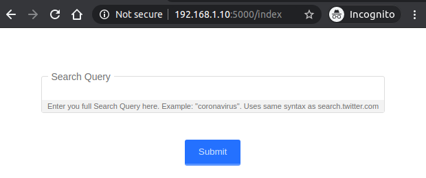

# Twitter on Raspberry
Streams real-time Twitter search queries and uses AWS Comprehend to do
sentiment analysis. Depending on the sentiment detected (positive, neutral
or negative), blinks a green, yellow or red LED.

## Video

## Instructions
Clone this repo in your RaspberryPi:
```
git clone http://github.com/amcarvalho/twitter-raspberry
```

Install requirements:
```
pip install -r requirements.txt
```

Define the following environment variables:
```
export TWITTER_CONSUMER_KEY=my_twitter_consumer_key
export TWITTER_CONSUMER_SECRET=my_twitter_consumer_secret
export TWITTER_ACCESS_TOKEN=my_twitter_access_token
export TWITTER_ACCESS_TOKEN_SECRET=my_twitter_access_token_secret
```
You can create a Twitter App and generate API keys/secrets
[here](https://developer.twitter.com/en/apps/).

Provide AWS credentials of an IAM user allowed to make AWS Comprehend API calls.

### Starting Services
Next you will need to run 3 separate shells (or detach each process).

#### Redis
Start a redis server:
```
sh run_redis.sh
```
On your first execution, the script will download and compile a redis server.
On a Raspberry Pi 3 this takes around 5m.

#### Celery
Start a Celery worker:
```
celery worker -A app.celery --loglevel=info
```

#### Flask
Start the Flask application:
```
FLASK_APP=twitter-raspberry.py & flask run --host 0.0.0.0
```
This is binding the Flask server on all network interfaces.

### Submitting a Search Term
You can access the search form using your Raspberry IP address within your network
on port `5000`.



